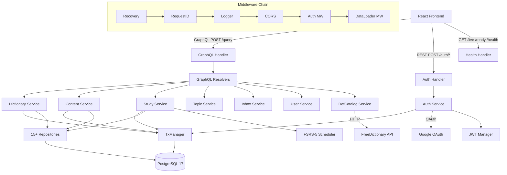

# Architecture

## System Overview

MyEnglish is a personal vocabulary learning backend that lets users build a custom English dictionary, study words with spaced repetition (FSRS-5), and organize vocabulary into topics. The system fetches definitions from a reference catalog (seeded from Wiktionary, NGSL, WordNet, etc.) and exposes a GraphQL API for the React frontend, with REST endpoints for auth and health checks.

The backend follows hexagonal (ports & adapters) architecture: domain entities and service interfaces at the center, with PostgreSQL repositories and HTTP transport as adapters. All dependencies point inward — services never know about HTTP or SQL.

## System Diagram



## Tech Stack

| Technology | Role | Notes |
|---|---|---|
| Go 1.24 | Language | stdlib HTTP server, slog logging |
| PostgreSQL 17 | Database | pgx v5 driver, pg_trgm for fuzzy search |
| gqlgen | GraphQL | Code-generated resolvers, autobind domain types |
| sqlc | SQL code gen | Type-safe queries from `.sql` files |
| Squirrel | Dynamic SQL | Filtering, cursor pagination, complex WHERE |
| FSRS-5 | SRS algorithm | Pre-calibrated 19-weight model for scheduling |
| JWT (HS256) | Auth | Access tokens (15m) + refresh tokens (30d) |
| Google OAuth 2.0 | Social login | Authorization code flow |
| goose | Migrations | 20 versioned SQL migrations |
| DataLoaders | N+1 prevention | Per-request batch loading (2ms window, 100 batch) |
| testcontainers | Testing | Real PostgreSQL for integration/E2E tests |
| Docker | Deployment | Multi-stage build, Alpine runtime, non-root |
| cleanenv | Config | ENV > YAML > defaults |

## Project Structure

```
backend_v4/
├── cmd/
│   ├── server/main.go              # HTTP server entrypoint (signal handling → app.Run)
│   └── seeder/main.go              # Dataset seeding pipeline (Wiktionary, NGSL, WordNet...)
├── internal/
│   ├── app/
│   │   ├── app.go                  # Full wiring: config → repos → services → transport → server
│   │   └── seeder/                 # Seeder pipeline phases
│   ├── domain/                     # Entities, enums, sentinel errors, validation
│   ├── service/                    # Business logic (8 services, interface-based deps)
│   │   ├── auth/                   #   Register, login (password/OAuth), tokens
│   │   ├── user/                   #   Profile, settings, admin user management
│   │   ├── dictionary/             #   Entry CRUD, import/export, catalog integration
│   │   ├── content/                #   Nested editing: senses → translations/examples
│   │   ├── study/                  #   SRS queue, review, undo, sessions, dashboard
│   │   │   └── fsrs/               #   FSRS-5 algorithm implementation
│   │   ├── refcatalog/             #   Fetch/cache reference entries
│   │   ├── topic/                  #   Topic CRUD, entry linking
│   │   ├── inbox/                  #   Quick word capture
│   │   └── enrichment/             #   LLM enrichment queue (admin)
│   ├── transport/
│   │   ├── graphql/                # gqlgen resolvers, schema, dataloaders
│   │   │   ├── schema/             #   9 .graphql files (dictionary, study, content...)
│   │   │   ├── resolver/           #   Resolver implementations
│   │   │   └── dataloader/         #   9 batch loaders for N+1 prevention
│   │   ├── rest/                   # Auth, health, admin REST handlers
│   │   └── middleware/             # Recovery, RequestID, Logger, CORS, Auth, RateLimit
│   ├── adapter/
│   │   ├── postgres/               # 15+ repo packages (sqlc + Squirrel per entity)
│   │   └── provider/               # FreeDictionary API, Google OAuth
│   ├── auth/                       # JWT generation/validation, OAuth identity
│   └── config/                     # Config struct, loader, validation
├── pkg/ctxutil/                    # Type-safe context helpers (UserID, Role, RequestID)
├── migrations/                     # 20 goose SQL migrations
├── tests/e2e/                      # Full-stack E2E tests (testcontainers)
├── config.yaml                     # Default configuration
├── Makefile                        # Build, test, generate, migrate commands
└── docker-compose.yml              # PostgreSQL + migrations + server
```

## Component Summary

| Component | Purpose | Details in |
|---|---|---|
| Auth Service | Register, login, tokens, OAuth | [COMPONENTS.md](COMPONENTS.md#auth-service) |
| Dictionary Service | Entry CRUD, import/export, catalog | [COMPONENTS.md](COMPONENTS.md#dictionary-service) |
| Study Service + FSRS | SRS queue, review, undo, dashboard | [COMPONENTS.md](COMPONENTS.md#study-service) |
| Content Service | Nested sense/translation/example editing | [COMPONENTS.md](COMPONENTS.md#content-service) |
| PostgreSQL Repos | 15+ entity repositories | [COMPONENTS.md](COMPONENTS.md#postgresql-repositories) |
| Middleware Chain | Auth, CORS, logging, rate limiting | [COMPONENTS.md](COMPONENTS.md#middleware-chain) |
| DataLoaders | Batch loading for GraphQL N+1 | [COMPONENTS.md](COMPONENTS.md#dataloaders) |
| RefCatalog Service | External dictionary API integration | [COMPONENTS.md](COMPONENTS.md#refcatalog-service) |
