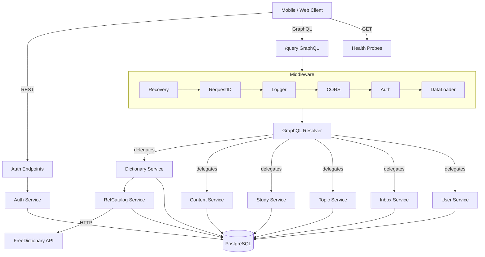

# Architecture

## System Overview

MyEnglish is a vocabulary-learning backend. Users build a personal dictionary by importing entries from a shared reference catalog (powered by FreeDictionary) or creating custom entries. Each entry holds senses (definitions), translations, examples, pronunciations, and images. Users organize entries into topics, then study them with a spaced-repetition (SRS) flashcard engine that tracks learning status, intervals, and review history. Authentication supports email/password and OAuth (Google, Apple). The API is primarily GraphQL with REST used for auth and health checks.

## System Diagram



## Tech Stack

| Technology | Role | Notes |
|---|---|---|
| Go 1.24 | Language | Standard library HTTP server, `log/slog` |
| PostgreSQL 17 | Primary database | via pgx v5 connection pool |
| gqlgen | GraphQL server | Code-first schema, generated resolvers |
| Squirrel | SQL builder | Used in repositories alongside sqlc |
| sqlc | SQL codegen | Generates type-safe Go from SQL queries |
| goose | Migrations | 11 migration files, run via CLI or Docker |
| JWT (HS256) | Access tokens | golang-jwt/jwt/v5 |
| bcrypt | Password hashing | Configurable cost (4--31) |
| DataLoader v7 | N+1 prevention | Batches nested GraphQL field resolution |
| Docker Compose | Local dev | Postgres + migrate + backend containers |
| testcontainers | E2E tests | Spins up Postgres in test process |
| moq | Mock generation | Interface mocks for unit tests |

## Project Structure

```
backend_v4/
├── cmd/
│   ├── server/main.go        # HTTP server entry point
│   └── cleanup/main.go       # Cron job: hard-delete old entries & audit logs
├── internal/
│   ├── app/                   # Bootstrap: wires all layers, starts server
│   ├── config/                # YAML + ENV config loading & validation
│   ├── domain/                # Core types, enums, errors (no dependencies)
│   ├── auth/                  # JWT manager, OAuth identity types
│   ├── service/               # Business logic (8 services)
│   │   ├── auth/              # Login, register, token refresh
│   │   ├── user/              # Profile & SRS settings
│   │   ├── dictionary/        # Entry CRUD, import/export, catalog linking
│   │   ├── content/           # Sense/translation/example/image editing
│   │   ├── study/             # SRS engine, sessions, dashboard
│   │   ├── topic/             # Entry grouping & organization
│   │   ├── inbox/             # Quick-capture notes
│   │   └── refcatalog/        # Reference dictionary fetch & cache
│   ├── adapter/
│   │   ├── postgres/          # 15 repository packages (pgx + squirrel/sqlc)
│   │   └── provider/          # External API clients (freedict, google, translate)
│   └── transport/
│       ├── rest/              # Auth + health HTTP handlers
│       ├── graphql/           # Schema, resolvers, error presenter, dataloaders
│       └── middleware/        # Recovery, RequestID, Logger, CORS, Auth, DataLoader
├── migrations/                # 11 SQL migration files (goose)
├── pkg/ctxutil/               # Context helpers (UserID, RequestID)
├── tests/e2e/                 # End-to-end tests (testcontainers)
├── config.yaml                # Default configuration
├── Makefile                   # Build, test, migrate, docker targets
├── Dockerfile                 # Multi-stage production build
├── Dockerfile.migrate         # Migration runner image
└── docker-compose.yml         # Local dev: postgres + migrate + backend
```

## High-Level Component List

| Component | Responsibility |
|---|---|
| **Auth Service** | OAuth + password login, JWT issuance, token refresh/revoke |
| **User Service** | Profile read/update, SRS preferences, audit-logged setting changes |
| **Dictionary Service** | Entry CRUD, catalog linking, soft delete, import/export |
| **Content Service** | Fine-grained editing of senses, translations, examples, images |
| **Study Service** | SRS algorithm, card lifecycle, sessions, dashboard stats |
| **Topic Service** | User-defined entry groups (create, link/unlink, batch) |
| **Inbox Service** | Quick-capture text notes for later processing |
| **RefCatalog Service** | Fetch + cache reference entries from FreeDictionary |

> For deep dives into each component, see [COMPONENTS.md](COMPONENTS.md).
