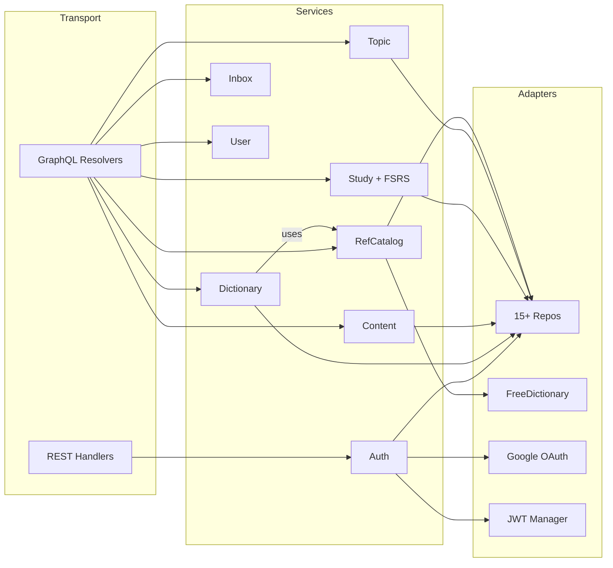

# Components

## Component Interaction Diagram



---

## Auth Service

**Purpose**: Handles user registration, password/OAuth login, JWT token issuance, refresh token rotation, and logout.

**Key interfaces**:
- `Register(ctx, RegisterInput) → *AuthResult` — create user + issue tokens
- `Login(ctx, LoginInput) → *AuthResult` — OAuth login (Google)
- `LoginWithPassword(ctx, LoginPasswordInput) → *AuthResult` — email/password login
- `Refresh(ctx, RefreshInput) → *AuthResult` — rotate refresh token, issue new access token
- `Logout(ctx) → error` — revoke all user refresh tokens
- `ValidateToken(ctx, token) → (userID, role, error)` — used by auth middleware

**Dependencies**: userRepo, settingsRepo, tokenRepo, authMethodRepo, txManager, oauthVerifier, jwtManager

**Important behaviors**:
- Password hashing uses bcrypt (cost 12). Refresh tokens stored as SHA-256 hashes — raw token only returned once.
- OAuth login creates a new user if the OAuth identity is new, or links to an existing user by email match.
- Token refresh revokes the old token before issuing a new pair (rotation prevents replay).
- Registration creates user, auth method, and default SRS settings atomically in a transaction.
- Field-level validation errors returned for email/username/password constraints.

---

## Dictionary Service

**Purpose**: Core entry CRUD — creating entries from the reference catalog or from scratch, searching/filtering/paginating the user's dictionary, soft-delete/restore, import/export, and notes.

**Key interfaces**:
- `CreateEntryFromCatalog(ctx, input) → *Entry` — link to reference catalog entry, optionally filter senses
- `CreateCustomEntry(ctx, input) → *Entry` — fully user-defined entry with nested senses
- `FindEntries(ctx, FindInput) → *FindResult` — filtered, sorted, cursor-paginated list
- `GetEntry(ctx, entryID) → *Entry` — single entry with all nested data
- `DeleteEntry(ctx, entryID)` / `RestoreEntry(ctx, entryID)` — soft delete + restore
- `ImportEntries(ctx, ImportInput) → ImportResult` — bulk import with chunked transactions
- `SearchCatalog(ctx, query, limit) → []RefEntry` — delegates to RefCatalog service

**Dependencies**: entryRepo, senseRepo, translationRepo, exampleRepo, pronunciationRepo, imageRepo, cardRepo, auditRepo, txManager, refCatalogService

**Important behaviors**:
- Enforces `MaxEntriesPerUser` (default 10,000) with TOCTOU-safe check inside transaction.
- Duplicate detection via `text_normalized` (lowercase, trimmed, single-spaced).
- Soft delete sets `deleted_at` — entry excluded from queries but restorable. Hard deletion of old soft-deleted entries after configurable retention (default 30 days).
- Import processes items in chunks (default 50) within separate transactions for partial success.
- Optionally creates an SRS card on entry creation (`CreateCard` flag).

---

## Content Service

**Purpose**: Manages nested content editing — senses, translations, examples, and user images within an entry. Supports reordering by position.

**Key interfaces**:
- `AddSense/UpdateSense/DeleteSense/ReorderSenses` — definition + part of speech + CEFR level
- `AddTranslation/UpdateTranslation/DeleteTranslation/ReorderTranslations` — per-sense translations
- `AddExample/UpdateExample/DeleteExample/ReorderExamples` — per-sense usage examples
- `AddUserImage/DeleteUserImage` — user-uploaded images per entry

**Dependencies**: entryRepo, senseRepo, translationRepo, exampleRepo, imageRepo, auditRepo, txManager

**Important behaviors**:
- Enforces per-entity limits: 20 senses/entry, 20 translations/sense, 50 examples/sense, 20 images/entry.
- Reordering uses position-based updates: client sends `[{id, position}]`, service updates all positions in a transaction.
- All mutations verify entry ownership via `JOIN entries WHERE user_id = ?` — no cross-user access.
- Audit logs capture before/after state for every mutation.

---

## Study Service

**Purpose**: FSRS-5 spaced repetition engine — manages study queues, card reviews, undo, sessions, and dashboard statistics.

**Key interfaces**:
- `GetStudyQueue(ctx, GetQueueInput) → []*Card` — due cards + new cards (respects daily limits)
- `ReviewCard(ctx, ReviewCardInput) → *Card` — grade card (AGAIN/HARD/GOOD/EASY), update FSRS state
- `UndoReview(ctx, UndoReviewInput) → *Card` — revert last review within 10-minute window
- `GetDashboard(ctx) → Dashboard` — due count, new count, streak, reviewed today, status counts
- `StartSession(ctx) / FinishSession(ctx) / AbandonSession(ctx)` — study session lifecycle
- `CreateCard(ctx, entryID) / BatchCreateCards(ctx, entryIDs)` — add entries to SRS

**Internal structure**:
```
study/
├── service.go          # Main service with all public methods
├── fsrs/
│   ├── algorithm.go    # FSRS-5 math: stability, difficulty, intervals
│   └── scheduler.go    # Scheduler interface: Schedule(card, grade, now)
└── service_test.go     # Comprehensive unit tests
```

**Dependencies**: cardRepo, reviewLogRepo, sessionRepo, entryRepo, senseRepo, settingsRepo, auditLogger, txManager, clock (injectable)

**Important behaviors**:
- **FSRS-5 algorithm**: 19 pre-calibrated weights control stability/difficulty calculations. Card states: `NEW → LEARNING → REVIEW → RELEARNING`. Learning steps (default: 1m, 10m) and relearning steps (default: 10m) are configurable.
- **Review flow**: Locks card with `SELECT FOR UPDATE`, creates `ReviewLog` with `CardSnapshot` (for undo), applies FSRS scheduling, commits atomically.
- **Undo**: Restores card from snapshot stored in `ReviewLog.PrevState`. Only works within `UndoWindowMinutes` (default 10).
- **Dashboard**: Uses `errgroup` to parallelize 7 queries (due count, new count, reviewed today, streak, status counts, overdue, active session).
- **Clock injection**: `clock` interface (real or test mock) enables deterministic time-based testing.
- **Queue**: Always returns all due cards (no ReviewsPerDay cap). NewCardsPerDay limits new cards only. Uses user's timezone for "today" calculations.

---

## RefCatalog Service

**Purpose**: Manages the reference dictionary — a read-only catalog of English words seeded from Wiktionary, NGSL, CMU, WordNet, and Tatoeba. Fetches missing entries from the FreeDictionary API on demand.

**Key interfaces**:
- `GetOrFetchEntry(ctx, text) → *RefEntry` — returns cached entry or fetches from API
- `Search(ctx, query, limit) → []RefEntry` — fuzzy search via pg_trgm
- `GetRelationsByEntryID(ctx, entryID) → []RefWordRelation` — synonyms, antonyms, hypernyms

**Dependencies**: refEntryRepo, txManager, dictionaryProvider (FreeDictionary), translationProvider

**Important behaviors**:
- RefEntries are immutable from the service perspective — only created/updated by the seeder pipeline or API fetch.
- Aggregate root: loading a RefEntry hydrates all 5 child tables (senses, translations, examples, pronunciations, images) in a single transaction.
- FreeDictionary API has retry (1x, 500ms backoff) and returns `nil, nil` for unknown words.

---

## PostgreSQL Repositories

**Purpose**: 15+ repository packages implementing data access with sqlc (static queries) and Squirrel (dynamic queries).

**Repository packages**: entry, sense, translation, example, pronunciation, image, card, reviewlog, session, user, token, authmethod, topic, inbox, refentry, audit, enrichment

**Important behaviors**:
- **Querier pattern**: All repos call `postgres.QuerierFromCtx(ctx, pool)` which returns the active `pgx.Tx` if in a transaction, or the connection pool otherwise. Repos never know about transactions explicitly.
- **Error mapping**: pgx `ErrNoRows` → `domain.ErrNotFound`, duplicate key → `domain.ErrAlreadyExists`, constraint violation → `domain.ErrConflict`.
- **Cursor pagination** (entry repo): Base64-encoded `sortValue|entryID` cursors for keyset pagination. Fetches `limit+1` rows to detect `hasNextPage`.
- **COALESCE inheritance** (sense repo): User senses fall back to reference catalog values via `COALESCE(s.definition, rs.definition)` in read queries.
- **Authorization**: Content repos JOIN against `entries` table to verify `user_id` ownership.

> Simplified: Each repo has its own `sqlc.yaml` + `query/*.sql` for code generation — see `internal/adapter/postgres/*/` for individual query details.

---

## Middleware Chain

**Purpose**: Composable HTTP middleware applied in specific order per route group.

**Execution order** (GraphQL route):

| # | Middleware | Purpose |
|---|---|---|
| 1 | Recovery | Catch panics, log stack trace, return 500 |
| 2 | RequestID | Generate/propagate `X-Request-Id` header |
| 3 | Logger | Structured logging: method, path, status, duration, user_id |
| 4 | CORS | Origin validation, preflight handling, credential support |
| 5 | Auth | Extract Bearer JWT → validate → store userID + role in context |
| 6 | DataLoader | Create per-request batch loaders (see below) |

**Route-specific stacks**:
- **Auth endpoints** (`/auth/*`): CORS + RateLimit (no auth middleware — these create tokens)
- **Admin endpoints** (`/admin/*`): Recovery + RequestID + Logger + CORS + Auth (no DataLoader)
- **Health endpoints** (`/live`, `/ready`, `/health`): No middleware

**Rate limiting**: Token bucket per IP, configurable limits (register: 5/min, login: 10/min, refresh: 20/min). Background goroutine cleans stale buckets.

---

## DataLoaders

**Purpose**: Prevent N+1 queries in GraphQL field resolvers by batching database lookups.

**9 loaders** (all per-request, 2ms wait, 100-item max batch):
- `SensesByEntryID`, `TranslationsBySenseID`, `ExamplesBySenseID`
- `PronunciationsByEntryID`, `CatalogImagesByEntryID`, `UserImagesByEntryID`
- `CardByEntryID`, `TopicsByEntryID`, `ReviewLogsByCardID`

**How it works**: When a GraphQL query requests `dictionaryEntries { senses { translations } }`, the resolver for `senses` calls `loaders.SensesByEntryID.Load(entryID)`. The DataLoader collects all entry IDs across the response within a 2ms window, then issues a single `GetByEntryIDs(ids)` batch query. Result is cached within the request.

**Key detail**: DataLoaders bypass services and call repos directly for read performance. They're created fresh per request via middleware — no cross-request caching.
