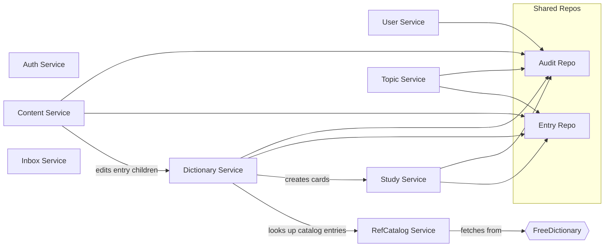

# Components

## Component Interaction Diagram

---

## Auth Service

**Purpose**: Handles user registration, OAuth login (Google/Apple), password-based login, JWT issuance, token refresh, and logout. Sits behind REST endpoints, not GraphQL.

**Key interfaces**:
- `Login(ctx, LoginInput) → *AuthResult` -- OAuth code exchange, find-or-create user
- `LoginWithPassword(ctx, LoginPasswordInput) → *AuthResult` -- email/password auth
- `Register(ctx, RegisterInput) → *AuthResult` -- create user + password auth method
- `Refresh(ctx, RefreshInput) → *AuthResult` -- validate refresh token, issue new pair
- `Logout(ctx) → error` -- revoke current refresh token
- `ValidateToken(ctx, token) → uuid.UUID` -- verify JWT, return userID (used by middleware)

**Dependencies**: userRepo, tokenRepo, authMethodRepo, txManager, oauthVerifier, jwtManager

**Important behaviors**:
- Refresh tokens are stored as SHA-256 hashes, never raw
- OAuth login auto-creates users on first sign-in and updates profile if provider data changes
- A user can have multiple auth methods (e.g., Google + password)

**Path**: `internal/service/auth/`

---

## User Service

**Purpose**: Read and update the authenticated user's profile (name, avatar) and SRS study preferences (cards/day, reviews/day, max interval, timezone).

**Key interfaces**:
- `GetProfile(ctx) → *User` -- returns current user
- `UpdateProfile(ctx, UpdateProfileInput) → *User` -- name + optional avatar
- `GetSettings(ctx) → *UserSettings` -- SRS preferences
- `UpdateSettings(ctx, UpdateSettingsInput) → *UserSettings` -- partial update in tx + audit

**Important behaviors**:
- Settings updates are transactional and audit-logged (old/new diff); profile updates are not
- All fields in `UpdateSettingsInput` are optional (nil = don't change)

**Path**: `internal/service/user/` -- see `user/docs/readme.md` for detailed business rules

---

## Dictionary Service

**Purpose**: Core dictionary operations -- creating entries (from catalog or custom), searching, soft-deleting, restoring, bulk import/export. The largest service by method count (~30 operations).

**Key interfaces**:
- `SearchCatalog(ctx, query, limit)` -- search reference catalog (no auth required)
- `PreviewRefEntry(ctx, text)` -- full catalog entry preview
- `CreateEntryFromCatalog(ctx, input)` / `CreateEntryCustom(ctx, input)` -- two creation paths
- `FindEntries(ctx, input)` -- filtered, paginated user dictionary (cursor + offset)
- `GetEntry(ctx, id)` -- single entry with all nested data
- `DeleteEntry` / `RestoreEntry` / `BatchDeleteEntries` -- soft delete lifecycle
- `ImportEntries(ctx, input)` / `ExportEntries(ctx)` -- bulk operations

**Dependencies**: entryRepo, senseRepo, translationRepo, exampleRepo, pronunciationRepo, imageRepo, cardRepo, auditRepo, txManager, refCatalogService

**Important behaviors**:
- Catalog entries are linked via `RefEntryID`; senses/translations/examples inherit from the catalog and can be overridden
- Import deduplicates by normalized text and processes in configurable chunk sizes
- Soft-deleted entries are hard-deleted by the `cmd/cleanup` cron job after a retention period

**Path**: `internal/service/dictionary/`

---

## Content Service

**Purpose**: Fine-grained CRUD for entry children: senses, translations, examples, and user images. Separated from Dictionary service to keep single-responsibility.

**Key interfaces**:
- `AddSense / UpdateSense / DeleteSense / ReorderSenses`
- `AddTranslation / UpdateTranslation / DeleteTranslation / ReorderTranslations`
- `AddExample / UpdateExample / DeleteExample / ReorderExamples`
- `AddUserImage / DeleteUserImage`

**Important behaviors**:
- Enforces per-entity limits: 20 senses/entry, 20 translations/sense, 50 examples/sense, 20 user images/entry
- CEFR levels validated against A1--C2 set
- Reorder operations accept a full list of `{id, position}` pairs and update atomically
- All mutations are ownership-checked (user must own the parent entry)

**Path**: `internal/service/content/`

---

## Study Service

**Purpose**: Spaced-repetition engine. Manages flashcard lifecycle (create/delete), the review queue, SRS calculations, study sessions, and the user dashboard.

**Key interfaces**:
- `GetStudyQueue(ctx, input)` -- combines due cards + new cards up to daily limits
- `ReviewCard(ctx, input)` -- apply grade (Again/Hard/Good/Easy), compute next review
- `UndoReview(ctx, input)` -- restore previous card state within undo window
- `StartSession / FinishSession / AbandonSession` -- session lifecycle
- `GetDashboard(ctx)` -- due count, new count, streak, status distribution
- `CreateCard / DeleteCard / BatchCreateCards` -- manual card management

**Dependencies**: cardRepo, reviewLogRepo, sessionRepo, entryRepo, senseRepo, settingsRepo, auditRepo, txManager, `domain.SRSConfig`

**Important behaviors**:
- SM-2 variant: cards progress NEW → LEARNING → REVIEW → MASTERED
- Learning uses configurable step durations (default: 1m, 10m)
- Undo stores a `CardSnapshot` (JSONB) with previous state
- Dashboard respects per-user `NewCardsPerDay` and `ReviewsPerDay` limits
- Study queue prioritizes due cards over new cards

**Path**: `internal/service/study/`

---

## Topic Service

**Purpose**: User-defined collections for organizing dictionary entries. Supports create/update/delete topics and linking/unlinking entries (including batch).

**Key interfaces**:
- `CreateTopic / UpdateTopic / DeleteTopic / ListTopics`
- `LinkEntry / UnlinkEntry / BatchLinkEntries`

**Important behaviors**:
- Maximum 100 topics per user
- `BatchLinkEntries` returns linked + skipped counts (already-linked entries are skipped, not errored)

**Path**: `internal/service/topic/`

---

## Inbox Service

**Purpose**: Lightweight quick-capture for text notes the user wants to process later (e.g., words heard in conversation).

**Key interfaces**:
- `CreateItem / ListItems / GetItem / DeleteItem / DeleteAll`

**Important behaviors**:
- Maximum 500 items per user
- No audit logging (low-risk, ephemeral data)

**Path**: `internal/service/inbox/`

---

## RefCatalog Service

**Purpose**: Bridges the Dictionary service and external dictionary APIs. Fetches, caches, and serves reference entries.

**Key interfaces**:
- `GetOrFetchEntry(ctx, text)` -- returns cached entry or fetches from FreeDictionary
- `GetRefEntry(ctx, refEntryID)` -- by ID
- `Search(ctx, query, limit)` -- search cached catalog

**Dependencies**: refEntryRepo, txManager, dictionaryProvider (freedict), translationProvider (stub)

**Important behaviors**:
- Fetched entries are stored as immutable reference data shared across all users
- Translation provider is currently a stub (returns empty); ready for future integration

**Path**: `internal/service/refcatalog/`

---

## Adapter Layer: Postgres Repositories

**Purpose**: 15 repository packages implement data access for all domain entities using pgx connection pool + Squirrel query builder (some with sqlc-generated queries).

**Shared patterns**:
- All repos accept `*pgxpool.Pool` (or pool + txManager for repos that need in-tx writes)
- `QuerierFromCtx(ctx)` returns the active transaction or falls back to pool -- this is how services run multiple repo calls in one transaction
- Soft delete via `deleted_at` column (entries only); hard delete in cleanup job

**Packages**: audit, authmethod, card, entry, example, image, inbox, pronunciation, refentry, reviewlog, sense, session, token, topic, translation, user

**Path**: `internal/adapter/postgres/`

---

## Adapter Layer: External Providers

| Provider | Path | Purpose |
|---|---|---|
| FreeDictionary | `adapter/provider/freedict/` | Fetches word definitions from FreeDictionary API |
| Google OAuth | `adapter/provider/google/` | Verifies Google OAuth authorization codes |
| Translation (stub) | `adapter/provider/translate/` | Placeholder for future translation API |

---

## Transport Layer: Middleware

Applied in order on GraphQL requests: Recovery → RequestID → Logger → CORS → Auth → DataLoader.

| Middleware | Behavior |
|---|---|
| **Recovery** | Catches panics, logs stack trace, returns 500 |
| **RequestID** | Generates UUID or reads `X-Request-ID`, stores in context |
| **Logger** | Logs method, path, status, duration, request_id, user_id |
| **CORS** | Handles preflight + response headers (configurable origins) |
| **Auth** | Extracts Bearer token, validates JWT, stores userID in context. Anonymous = OK; invalid token = 401 |
| **DataLoader** | Injects per-request batch loaders to prevent N+1 queries |

**Path**: `internal/transport/middleware/`
