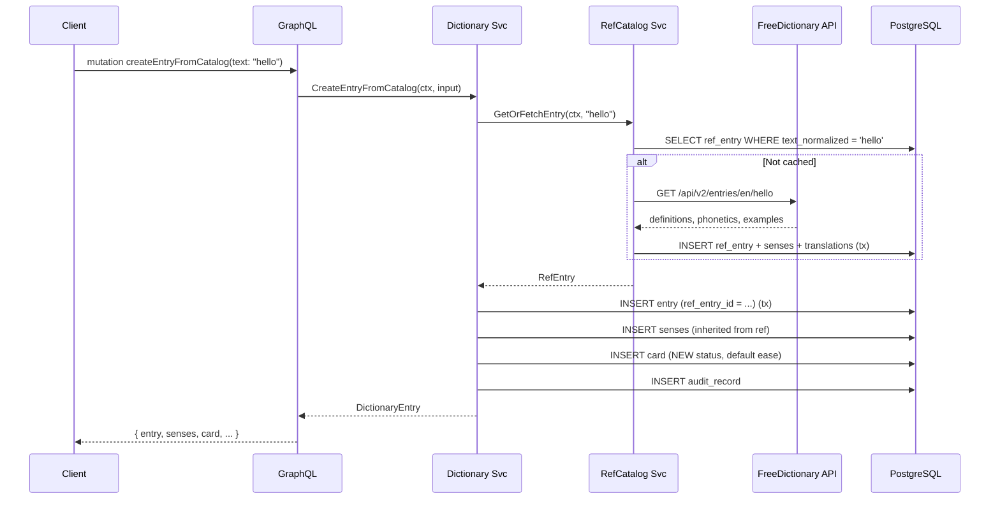
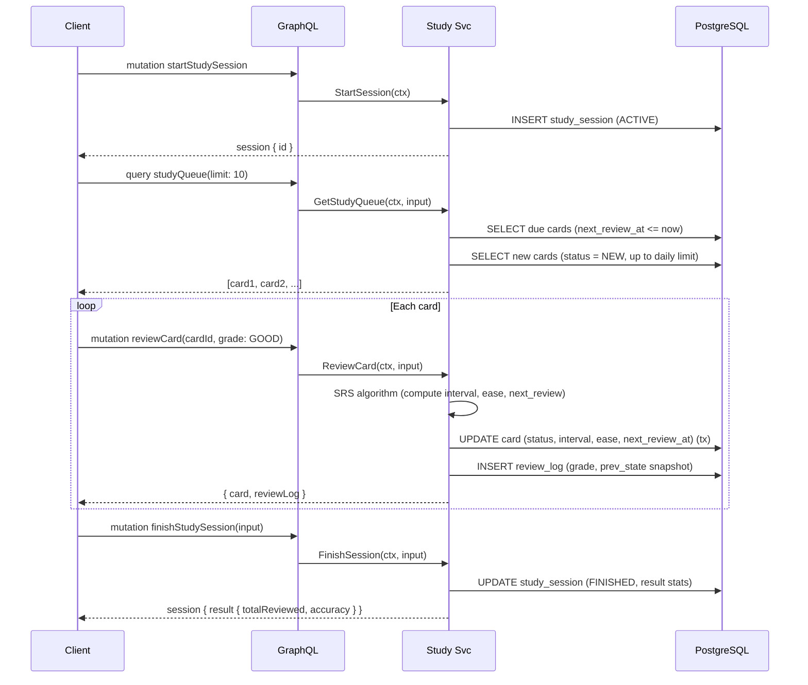
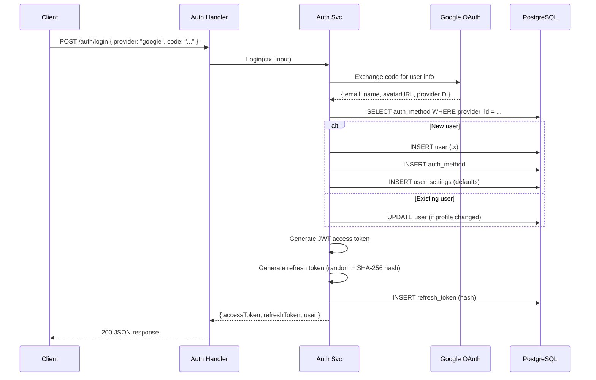
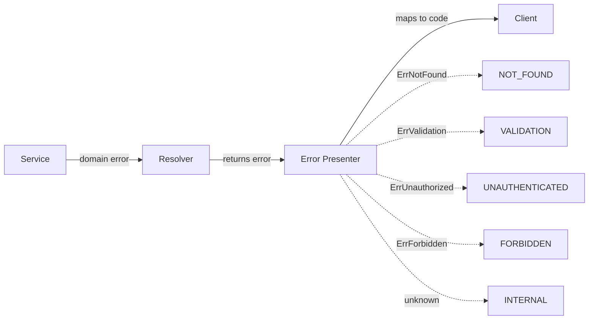

# Data Flow

## Entry Points

| Protocol | Path | Auth | Purpose |
|---|---|---|---|
| REST | `POST /auth/*` | Public | Registration, login, token refresh, logout |
| REST | `GET /live, /ready, /health` | Public | Health/readiness probes |
| GraphQL | `POST /query` | Bearer JWT | All dictionary, content, study, topic, inbox, user operations |
| GraphQL | `GET /` | Public | Playground (dev only) |
| CLI | `cmd/cleanup` | N/A (cron) | Hard-delete old entries + audit records |

---

## Flow 1: User Creates Entry from Catalog

The most common write path -- user looks up a word and adds it to their dictionary.



---

## Flow 2: Study Session (Card Review)

User reviews flashcards with SRS algorithm deciding next review time.



---

## Flow 3: Authentication (OAuth)



---

## Processing Pipeline Summary

All write operations follow this pattern:

```
Request → Middleware (auth, logging) → Resolver → Service
    Service:
    1. Validate input (domain.ValidationError if bad)
    2. Check auth (ErrUnauthorized if missing)
    3. Check ownership (ErrForbidden if wrong user)
    4. Execute business logic (often in RunInTx)
    5. Create audit record (for significant mutations)
    6. Return result
```

## Error Flow



Validation errors include field-level details in the GraphQL error extensions.
