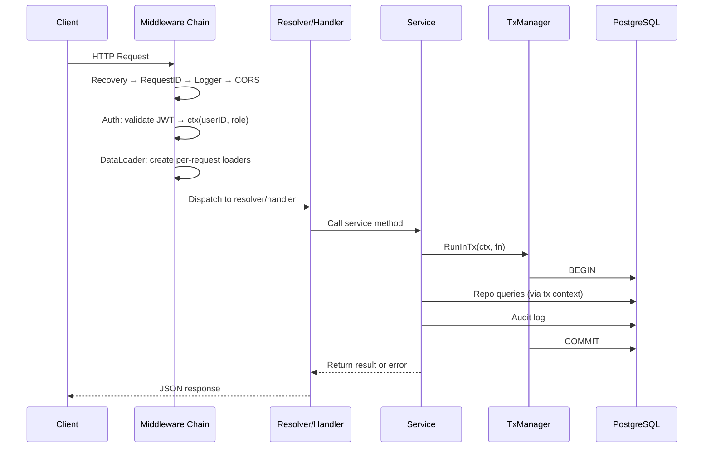
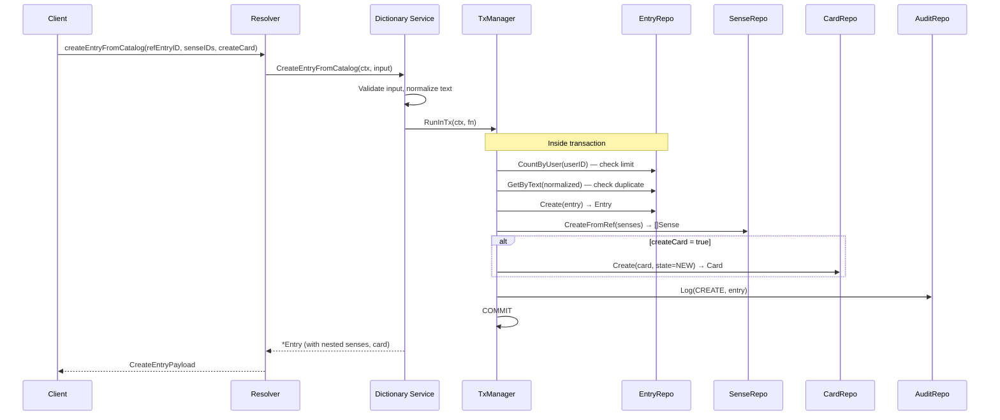
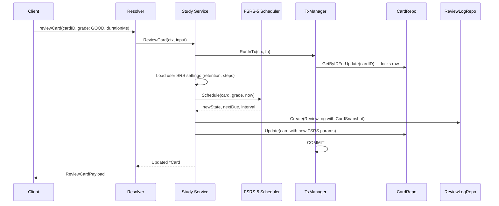
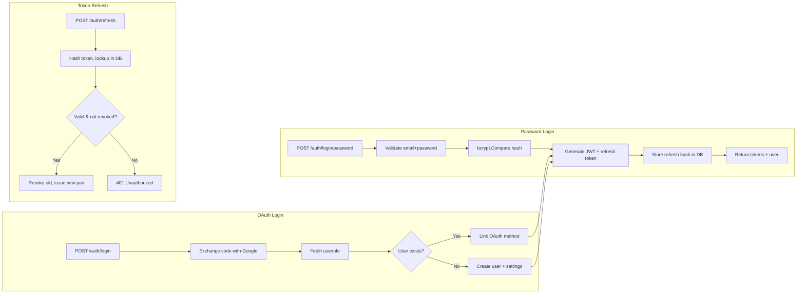
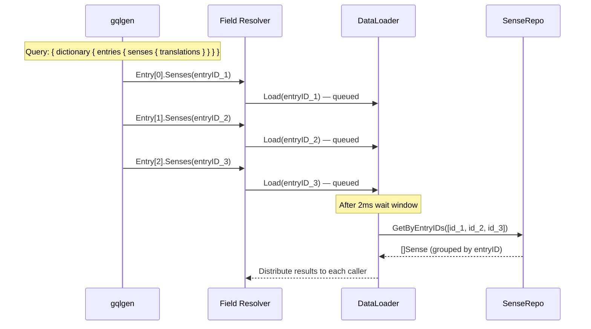

# Data Flow

## Main Request Lifecycle

Every request follows this path through the middleware chain before reaching business logic:



## Creating a Dictionary Entry from Catalog

The most complex write flow — creates an entry by linking to reference catalog data:



## SRS Review Flow

How a card review updates FSRS-5 scheduling state:



## Authentication Flow



## GraphQL Field Resolution with DataLoaders

How nested data loads avoid N+1 queries:



## Error Propagation

```
PostgreSQL error (e.g., unique constraint)
  ↓ Repository maps to domain error
domain.ErrAlreadyExists
  ↓ Service returns error
  ↓ Resolver receives error
  ↓ gqlgen ErrorPresenter maps to GraphQL error
GraphQL response: { errors: [{ message, extensions: { code: "ALREADY_EXISTS" } }] }

REST equivalent: { error: "already exists", code: "CONFLICT" } with HTTP 409
```

## Transaction Context Pattern

```
Service calls txm.RunInTx(ctx, fn)
  ↓ TxManager begins pgx.Tx
  ↓ Stores tx in context: ctx = withTx(ctx, tx)
  ↓ Passes ctx to callback fn(ctx)
    ↓ Repo calls QuerierFromCtx(ctx, pool)
    ↓ Finds tx in context → uses tx instead of pool
    ↓ All repo calls within fn share the same transaction
  ↓ fn returns nil → COMMIT
  ↓ fn returns error → ROLLBACK
```
