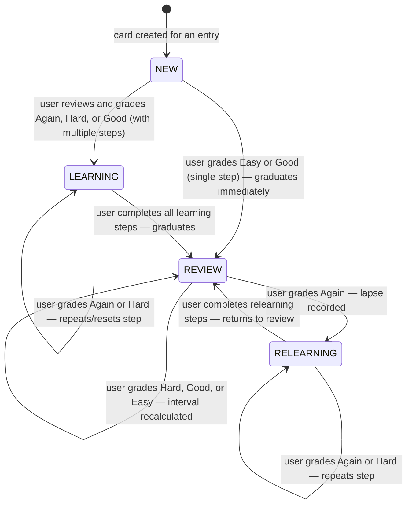
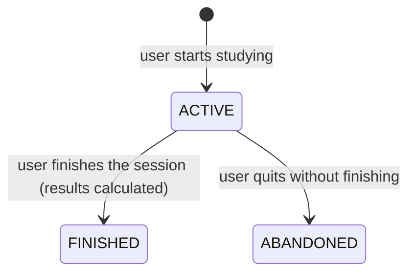
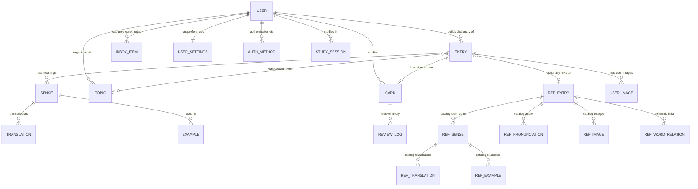

# Domain Model

## Entities

### User
**What it is**: A person who uses the platform to learn English vocabulary.

**Key attributes**:
| Attribute | Business meaning | Possible values |
|---|---|---|
| Email | Login identifier, must be unique across the platform | Any valid email, stored lowercase |
| Username | Display name, must be unique | 2-50 characters |
| Name | Full name (initially set to username, updated via OAuth profile) | Up to 255 characters |
| Role | Authorization level | `user` (default) or `admin` |
| Avatar URL | Profile picture, often from OAuth provider | Optional URL |

**Code location**: `internal/domain/user.go`

### User Settings
**What it is**: Per-user preferences that control the study experience.

**Key attributes**:
| Attribute | Business meaning | Default |
|---|---|---|
| New Cards Per Day | Maximum new words introduced per day | 20 |
| Reviews Per Day | Daily review goal (informational, NOT enforced) | 200 |
| Max Interval Days | Longest gap between reviews for any card | 365 days |
| Desired Retention | Target probability of remembering a card when it's due | 90% (0.9) |
| Timezone | User's timezone, used for "today" calculations | UTC |

**Code location**: `internal/domain/user.go`

> **Important**: "Reviews Per Day" is NOT a hard limit. Due cards are always shown regardless of this setting — the system never hides cards that need review. This is a deliberate design decision to prevent long-term retention degradation.

---

### Entry (Dictionary Entry)
**What it is**: A word or phrase in a user's personal dictionary.

**Key attributes**:
| Attribute | Business meaning | Possible values |
|---|---|---|
| Text | The word or phrase itself | Up to 500 characters |
| Text Normalized | Lowercased version for deduplication | Computed automatically |
| Ref Entry ID | Link to the shared reference catalog (if created from catalog) | Optional UUID |
| Notes | Personal notes the user attaches to the word | Optional, up to 5000 characters |
| Deleted At | Soft-deletion timestamp (entry is hidden but recoverable) | NULL = active, timestamp = deleted |

**Lifecycle**: Entries are soft-deleted first, then permanently removed after a configurable retention period (default: 30 days) by a background cleanup job.

**Code location**: `internal/domain/entry.go`, `internal/service/dictionary/`

### Sense
**What it is**: A specific meaning or definition of a word. A word can have multiple senses — for example, "run" can mean "to move quickly" or "to operate a program."

**Key attributes**:
| Attribute | Business meaning | Possible values |
|---|---|---|
| Definition | The meaning explained in words | Up to 2000 characters |
| Part of Speech | Grammatical category | NOUN, VERB, ADJECTIVE, ADVERB, PRONOUN, PREPOSITION, CONJUNCTION, INTERJECTION, PHRASE, IDIOM, OTHER |
| CEFR Level | European language proficiency level | A1, A2, B1, B2, C1, C2 |
| Position | Display order among sibling senses | Integer |

Each sense can have **translations** (in other languages, up to 500 chars each) and **examples** (usage sentences, up to 2000 chars each).

Senses can be user-created (custom) or inherited from the reference catalog (linked via `ref_sense_id`).

**Code location**: `internal/domain/entry.go`

---

### Card (Flashcard)
**What it is**: A flashcard linked 1:1 with a dictionary entry. The card tracks the user's learning progress for that word using the FSRS-5 spaced repetition algorithm.

**Key attributes**:
| Attribute | Business meaning | Possible values |
|---|---|---|
| State | Where the card is in its learning lifecycle | NEW, LEARNING, REVIEW, RELEARNING |
| Stability | How long the memory is expected to last (in days) | Positive decimal, min 0.1 |
| Difficulty | How inherently hard this card is to remember | 1.0 (easy) to 10.0 (very hard) |
| Due | When the card should next be shown for review | Timestamp |
| Reps | Total number of times the card has been reviewed | Non-negative integer |
| Lapses | Number of times the user forgot a previously-learned card | Non-negative integer |

**Lifecycle**:

**Business events that trigger transitions**:
- **NEW → LEARNING**: First review, user didn't recall perfectly
- **LEARNING → REVIEW**: User completes all learning steps (graduates)
- **REVIEW → RELEARNING**: User forgets the word (lapse). Lapse counter increases
- **RELEARNING → REVIEW**: User relearns the word successfully

**Code location**: `internal/domain/card.go`, `internal/service/study/fsrs/scheduler.go`

### Review Log
**What it is**: A record of a single review event — when a user saw a flashcard and graded their recall.

**Key attributes**:
| Attribute | Business meaning | Possible values |
|---|---|---|
| Grade | User's self-assessed recall quality | AGAIN (forgot), HARD (barely remembered), GOOD (remembered), EASY (effortless) |
| Duration Ms | How long the user spent on this card (optional) | 0 - 600,000 ms (10 min max) |
| Prev State | Snapshot of the card's state before this review (enables undo) | Full FSRS state snapshot |

**Code location**: `internal/domain/card.go`

### Study Session
**What it is**: A bounded study period. The user starts a session, reviews cards, then finishes or abandons it.

**Key attributes**:
| Attribute | Business meaning | Possible values |
|---|---|---|
| Status | Current session state | ACTIVE, FINISHED, ABANDONED |
| Result | Aggregated statistics after finishing | Total reviewed, new reviewed, grade counts, duration, accuracy rate |

**Lifecycle**:

- Only one ACTIVE session per user at a time (enforced, idempotent)
- Starting a session when one is already active returns the existing session
- Abandoning when no session exists is a silent no-op

**Code location**: `internal/domain/card.go`

---

### Reference Catalog
**What it is**: A shared, immutable knowledge base of English words with definitions, translations, examples, pronunciations, and images. Users don't own catalog data — they link to it when creating dictionary entries.

**Key entities**:
| Entity | What it contains |
|---|---|
| Ref Entry | The word itself, with frequency rank, CEFR level, and core lexicon flag |
| Ref Sense | Definitions from various sources |
| Ref Translation | Translations in other languages |
| Ref Example | Usage sentences (e.g., from Tatoeba corpus) |
| Ref Pronunciation | Phonetic transcriptions and audio URLs (e.g., from CMU) |
| Ref Image | Visual associations from external sources |
| Ref Word Relation | Semantic links: synonyms, hypernyms, antonyms, derived forms |

Each piece of catalog data is tagged with a `source_slug` identifying which data source it came from.

**Data sources** (seeded from external corpora):
| Source | What it provides |
|---|---|
| CMU | Pronunciation data |
| NGSL | Frequency rankings |
| Tatoeba | Example sentences |
| Wiktionary | Definitions |
| WordNet | Synonyms and word relations |

**Code location**: `internal/domain/reference.go`

---

### Topic
**What it is**: A user-created category for organizing dictionary entries. Examples: "Travel vocabulary", "Business English", "IELTS words."

| Attribute | Business meaning |
|---|---|
| Name | Category name, up to 100 characters |
| Description | Optional description, up to 500 characters |
| Entry Count | Number of entries linked to this topic (computed, not stored) |

Entries can belong to multiple topics. Topics are per-user.

**Code location**: `internal/domain/organization.go`

### Inbox Item
**What it is**: A quick-capture note for words or phrases the user wants to look up later. A "to-do list" for vocabulary.

| Attribute | Business meaning |
|---|---|
| Text | The word or phrase to look up | 1-500 characters |
| Context | Where the user encountered it (optional) | Up to 2000 characters |

**Code location**: `internal/domain/organization.go`

### Enrichment Queue Item
**What it is**: A reference catalog entry queued for AI enrichment. When a user adds a word from the catalog, the system can queue it for LLM-powered enhancement (additional definitions, examples, translations).

**Lifecycle**: `pending` → `processing` → `done` or `failed`

**Code location**: `internal/domain/enrichment.go`

---

## Entity Relationships

**Key relationships**:
- An Entry has **at most one Card** — a word is either being studied or not
- An Entry can optionally **link to a Reference Catalog entry** to inherit rich data
- Senses, Translations, and Examples can be user-created OR inherited from the catalog
- A User can have **multiple authentication methods** (password + Google + Apple)
- Topics and Entries have a **many-to-many** relationship
