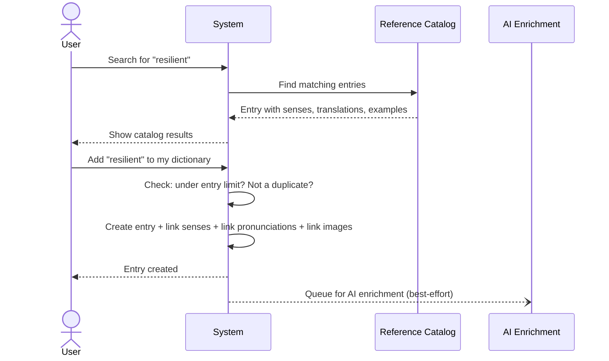
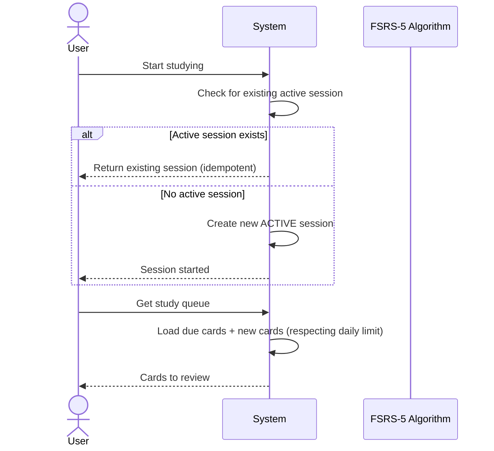
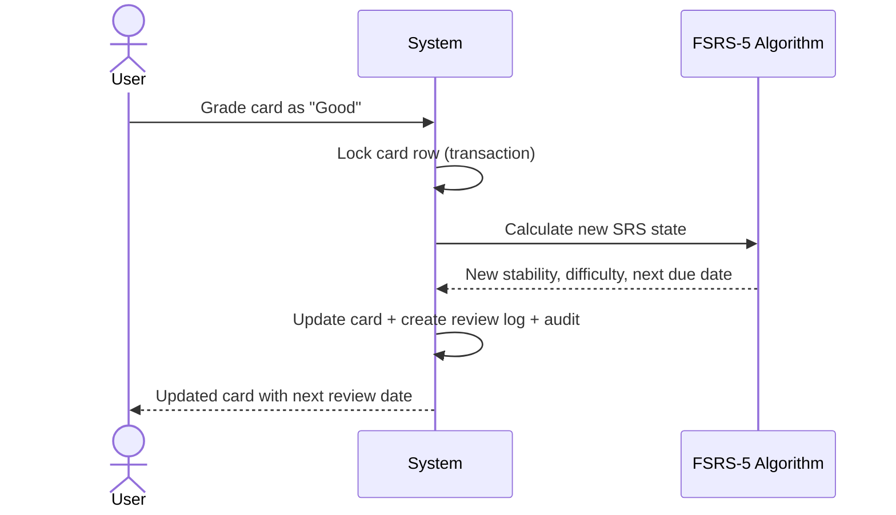

# Business Workflows

## Workflow 1: User Registration & Authentication

**Actors**: User, System, OAuth Provider (Google/Apple)
**Trigger**: User opens the app for the first time
**Outcome**: User account created with default study settings, authentication tokens issued

### Path A: Email + Password Registration
1. **User submits email, username, and password**
   - System validates: email contains "@" (max 254 chars), username 2-50 chars, password 8-72 chars
   - Email is lowercased and trimmed

2. **System checks uniqueness**
   - Email and username must be unique (enforced by database constraints)
   - If email or username taken → "already exists" error

3. **System creates account (in transaction)**
   - User record created
   - Password hashed with bcrypt (cost factor: configurable, default 12)
   - Auth method record created (type: `password`)
   - Default user settings created: 20 new cards/day, 200 reviews/day goal, 90% retention, 365-day max interval, UTC timezone

4. **System issues tokens**
   - JWT access token (15 min TTL by default)
   - Cryptographic refresh token (30 days TTL by default), stored as SHA-256 hash in database

**Code**: `internal/service/auth/register.go`

### Path B: OAuth Login (Google or Apple)
1. **User clicks "Sign in with Google/Apple"**
   - System validates: provider is configured and allowed, auth code provided

2. **System verifies OAuth code with provider**
   - Exchanges code for identity (email, name, avatar, provider ID)

3. **System checks for existing account** (three scenarios):
   - **Returning OAuth user**: Auth method found → load user, update profile if changed, issue tokens
   - **Existing email user (account linking)**: No auth method for this OAuth, but email matches existing account → link OAuth method to existing account, issue tokens
   - **New user**: No existing account → create user + auth method + default settings (in transaction), issue tokens

4. **Profile sync**: On each OAuth login, the system checks if name or avatar changed and updates accordingly

**Code**: `internal/service/auth/login.go`

### Path C: Password Login
1. **User submits email and password**
2. **System looks up user by email** → not found = "unauthorized"
3. **System finds password auth method** → not found (OAuth-only user) = "unauthorized"
4. **System verifies password** with bcrypt → mismatch = "unauthorized"
5. **System issues tokens**

**Security note**: The system returns the same "unauthorized" error for all failure reasons (email not found, OAuth-only account, wrong password) to prevent account enumeration.

**Code**: `internal/service/auth/login_password.go`

### Token Refresh
1. **Client sends refresh token** when access token expires
2. **System hashes token**, looks up in database
3. **System validates**: token exists (reuse detection), not expired, user still exists
4. **System revokes old token**, issues new access + refresh token pair (rotation)

**Security**: If a refresh token is not found (possible token reuse attack), a warning is logged.

**Code**: `internal/service/auth/refresh.go`

### Logout
- Revokes **all** refresh tokens for the user (not just the current one)
- Forces re-authentication on all devices

**Code**: `internal/service/auth/logout.go`

---

## Workflow 2: Building a Personal Dictionary

**Actors**: User, System, Reference Catalog
**Trigger**: User wants to learn a new word
**Outcome**: Word added to personal dictionary, optionally with a flashcard

### Path A: Add Word from Reference Catalog

1. **User searches the reference catalog** for a word
2. **System returns matching catalog entries** with definitions, translations, examples
3. **User selects a catalog entry to add** — optionally picks specific senses (max 20) or takes all
4. **System validates**:
   - User hasn't exceeded entry limit (default: 10,000 entries)
   - Word doesn't already exist in user's dictionary (checked by normalized text)
5. **System creates entry (in transaction)**:
   - Entry record linked to catalog entry
   - User senses linked to catalog senses (with translations and examples)
   - Pronunciations and images linked
   - Flashcard created if requested
   - Audit record created
6. **System queues word for AI enrichment** (best-effort, doesn't fail the request)

**Code**: `internal/service/dictionary/create_from_catalog.go`

### Path B: Add Custom Word (Not in Catalog)

1. **User types a word and provides their own definitions**
2. **System validates**: text not empty (max 500 chars), senses valid (max 20), entry limit not exceeded, not a duplicate
3. **System creates entry (in transaction)** with user-provided senses, translations, and examples
4. Source is tagged as `"user"` (vs. `"catalog"` for catalog entries)

**Code**: `internal/service/dictionary/create_custom.go`

### Path C: Bulk Import

1. **User submits a batch of words** (1-5,000 items per import)
2. **System validates**: total wouldn't exceed entry limit
3. **System processes in chunks** (configurable chunk size, default 50):
   - Each chunk runs in its own transaction
   - Duplicates (within the import or existing dictionary) are skipped, not failed
   - Per-item results: imported, skipped, or error with reason
4. If a chunk transaction fails, all items in that chunk are marked as errors, and the system continues with the next chunk

**Code**: `internal/service/dictionary/import_entries.go`

### Deleting Entries
- **Soft delete**: Entry is marked as deleted (hidden from dictionary, but recoverable)
- **Restore**: Soft-deleted entries can be restored
- **Hard delete**: After 30 days (configurable), a cleanup job permanently removes soft-deleted entries
- **Batch delete**: Up to 200 entries at once, partial failure allowed (not transactional)

**Code**: `internal/service/dictionary/delete_entry.go`

---

## Workflow 3: Studying Vocabulary (Spaced Repetition)

**Actors**: User, System, FSRS-5 Algorithm
**Trigger**: User opens the study screen
**Outcome**: Cards reviewed, learning progress updated

### Starting a Study Session

1. **User starts a session** — only one active session allowed at a time
   - If already active → returns existing (idempotent, handles race conditions)
2. **System builds a study queue**:
   - **Due cards first**: All cards past their due date (ALWAYS shown, no daily limit)
   - **New cards to fill**: If slots remain, add NEW cards up to the daily "new cards" limit
   - Default queue size: 50 cards per request (max 200)
3. "New today" is tracked per user's local timezone (midnight boundary)

**Code**: `internal/service/study/session.go`, `internal/service/study/study_queue.go`

### Reviewing a Card

1. **User sees a card** and self-assesses recall:
   - **Again**: Forgot the word entirely
   - **Hard**: Barely remembered, took effort
   - **Good**: Remembered correctly
   - **Easy**: Effortless, obvious
2. **System calculates new card state** using FSRS-5:
   - For NEW cards: Sets initial stability and difficulty based on rating
   - For LEARNING/RELEARNING cards: Advances through learning steps or graduates to REVIEW
   - For REVIEW cards: Recalculates stability, difficulty, and next interval
   - If rating is "Again" on a REVIEW card → card lapses (enters RELEARNING, lapse count increases)
3. **System stores**: updated card state, review log (with previous state snapshot for undo), audit record
4. **All within a transaction** with row-level card locking to prevent concurrent review issues

**Code**: `internal/service/study/review_card.go`, `internal/service/study/fsrs/scheduler.go`

### Undoing a Review

1. **User realizes they graded incorrectly** and requests undo
2. **System checks**: review log exists, previous state snapshot exists, within undo window (default: 10 minutes)
3. **System restores** the card to its pre-review state (from the snapshot)
4. **System deletes** the review log entry
5. If the undo window has expired → "undo window expired" error

**Code**: `internal/service/study/undo_review.go`

### Finishing a Session

1. **User finishes the session**
2. **System aggregates results** from all review logs during the session:
   - Total cards reviewed, new cards reviewed, due cards reviewed
   - Grade distribution (again/hard/good/easy counts)
   - Total duration
   - Accuracy rate (good + easy as percentage of total)
3. **Session status → FINISHED**

Alternative: **Abandon session** — marks as ABANDONED without calculating results. Idempotent (no-op if no active session).

**Code**: `internal/service/study/session.go`

---

## Workflow 4: Viewing the Dashboard

**Actors**: User, System
**Trigger**: User opens the app's home screen
**Outcome**: User sees their study statistics and what needs attention

The dashboard loads 8 metrics in parallel:
| Metric | Meaning |
|---|---|
| Due Count | Cards that need review right now |
| New Count | Cards not yet studied |
| Reviewed Today | Total reviews completed today |
| New Today | New cards studied today |
| Overdue Count | Cards past their due date since the start of today |
| Streak | Consecutive days with at least one review |
| Status Counts | Cards by state (New, Learning, Review, Relearning) |
| Active Session | Whether a study session is currently in progress |

**Streak calculation**: Counts consecutive days backward from today (or yesterday if today has no reviews yet). A streak breaks on any day with zero reviews.

**Code**: `internal/service/study/dashboard.go`

---

## Workflow 5: Organizing with Topics

1. **User creates a topic** (e.g., "IELTS Vocabulary")
2. **User links entries to topics** — individual or batch (up to 200 at once)
3. **User browses entries by topic** — can filter their dictionary view
4. An entry can belong to multiple topics
5. Topics can be renamed, have their description updated, or be deleted

**Code**: `internal/service/topic/`

---

## Workflow 6: Inbox (Quick Capture)

1. **User hears an unfamiliar word** and jots it down in the inbox
2. **Later**, user processes inbox items — looks up words and adds them to dictionary
3. **User deletes processed inbox items**

This is a simple note-taking feature — inbox items don't connect to entries or cards. They're just text reminders.

**Code**: `internal/service/inbox/`
